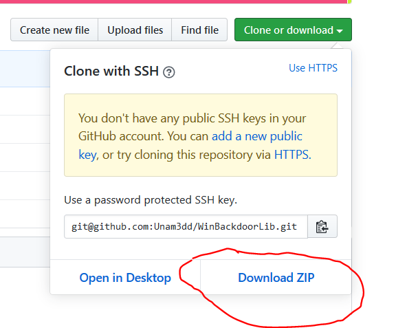

<h1>Welcome to WinBackdoorLib</h1>

For download WinBackdoorLib visit [my github page](https://github.com/Unam3dd/WinBackdoorLib).

<h3> Latest Version : 0.4 </h3><br></br>

This Library is for the creation of Backdoor, Keylogger etc..,  in a Simplified way is accessible to all.

<h4> How To Downloads, Install and Using </h4>

<h5> Install on Linux :</h5>

```sh
sudo apt update && apt install git mingw-w64-* -y && sudo git clone https://github.com/Unam3dd/WinBackdoorLib
```

<h5> Install on Windows :</h5>

Install Mingw Or TDM GCC compiler on windows machine or use visual studio


Go To [download link](https://github.com/Unam3dd/WinBackdoorLib) and click on "clone or download" and Download



